# FreeMiNT Thread Lifecycle Diagram

This document provides a comprehensive overview of the thread lifecycle in FreeMiNT, showing the complete workflow from thread creation to termination, including scheduling, state transitions, and signal handling mechanisms.

## Thread Lifecycle Diagram

```mermaid
graph TD
    %% Thread Creation
    subgraph "Thread Creation"
        sys_p_createthread["sys_p_createthread()"] --> create_thread
        create_thread --> init_thread0["init_thread0()"]
        create_thread --> init_thread_context
        create_thread --> add_to_ready_queue
        create_thread --> start_thread_timing
        start_thread_timing --> thread_timer_start
    end

    %% Thread Execution
    subgraph "Thread Execution"
        thread_start --> thread_function
        thread_function --> thread_exit
    end

    %% State Management
    subgraph "State Transitions"
        CREATED -- add_to_ready_queue --> READY
        READY -- schedule/thread_switch --> RUNNING
        RUNNING -- sys_p_sched_yield --> READY
        RUNNING -- preempt_handler --> READY
        RUNNING -- sys_p_sleepthread --> SLEEPING
        RUNNING -- sys_p_thread_sigwait --> BLOCKED
        RUNNING -- thread_exit --> EXITED
        SLEEPING -- timeout --> READY
        BLOCKED -- signal/timeout --> READY
    end

    %% Scheduling
    subgraph "Scheduling"
        schedule --> get_highest_priority_thread["get_highest_priority_thread()"]
        get_highest_priority_thread --> should_schedule_thread["should_schedule_thread()"]
        should_schedule_thread -- yes --> thread_switch
        thread_switch --> save_context
        thread_switch --> change_context
    end

    %% Signal Handling
    subgraph "Signal Handling"
        sys_p_kill_thread --> deliver_signal_to_thread
        deliver_signal_to_thread --> SET_THREAD_SIGPENDING["SET_THREAD_SIGPENDING(t)"]
        SET_THREAD_SIGPENDING --> wake["Wake thread if blocked"]
        dispatch_thread_signals --> check_thread_signals
        check_thread_signals -- signal pending --> handle_thread_signal
        handle_thread_signal --> thread_signal_trampoline
    end

    %% Timer & Preemption
    subgraph "Timer & Preemption"
        thread_timer_start --> addtimeout["addtimeout(thread_preempt_handler)"]
        thread_preempt_handler --> update_thread_timeslice["update_thread_timeslice()"]
        update_thread_timeslice --> schedule
        thread_switch_timeout_handler --> reset_thread_switch_state["reset_thread_switch_state()"]
    end

    %% Process Termination
    subgraph "Process Termination"
        terminate --> cleanup_process_threads
        cleanup_process_threads --> thread_timer_stop
        cleanup_process_threads --> cancel_thread_timeouts["Cancel thread timeouts"]
        cleanup_process_threads --> remove_thread_from_wait_queues
        cleanup_process_threads --> free_thread_resources["Free thread resources"]
        cleanup_process_threads --> cleanup_thread_sync_states
    end

    %% Style
    classDef creation fill:#f9f,stroke:#333
    classDef execution fill:#6cf,stroke:#333
    classDef states fill:#ff9,stroke:#333
    classDef scheduling fill:#6f6,stroke:#333
    classDef signals fill:#9cf,stroke:#333
    classDef timing fill:#f96,stroke:#333
    classDef termination fill:#f66,stroke:#333
    
    class sys_p_createthread,create_thread,init_thread_context creation
    class thread_start,thread_function,thread_exit execution
    class CREATED,READY,RUNNING,SLEEPING,BLOCKED,EXITED states
    class schedule,thread_switch,get_highest_priority_thread scheduling
    class sys_p_kill_thread,deliver_signal_to_thread,thread_signal_trampoline signals
    class thread_timer_start,thread_preempt_handler timing
    class terminate,cleanup_process_threads,cleanup_thread_sync_states termination
```

## Thread Lifecycle Explanation

### 1. Thread Creation
- **sys_p_createthread**: System call entry point for thread creation
- **create_thread**: Allocates thread structure, initializes basic fields
- **init_thread0**: Initializes thread0 context before any thread creation
- **init_thread_context**: Sets up stack and execution context for the new thread
- **add_to_ready_queue**: Adds the thread to the ready queue for scheduling
- **start_thread_timing**: Starts the preemption timer for new threads
- **Priority boost**: New threads receive `THREAD_CREATION_PRIORITY_BOOST`

### 2. Thread Execution
- **thread_start**: Entry point for all threads, calls the thread function
- **thread function**: User-provided function that contains thread logic
- **thread_exit**: Cleans up resources and terminates the thread

### 3. Thread States
- **CREATED**: Initial state after thread allocation
- **READY**: Thread is ready to run but not currently executing
- **RUNNING**: Thread is currently executing
- **SLEEPING**: Thread is sleeping for a specified time
- **BLOCKED**: Thread is waiting for a signal, mutex, semaphore, or other resource
- **EXITED**: Thread has terminated

### 4. Scheduling
- **schedule**: Selects the next thread to run based on scheduling policy
- **get_highest_priority_thread**: Finds highest priority ready thread
- **should_schedule_thread**: Determines if context switch should occur
- **thread_switch**: Performs context switch between threads
- **Default policy**: `SCHED_OTHER` (not SCHED_FIFO)
- **Priority range**: 0 (lowest) to 99 (highest) - POSIX compliant
- **Timeslice calculation**: Based on process-specific parameters

### 5. Scheduling Operations
- **PSCHED_SETPARAM**: Sets scheduling policy and priority
- **PSCHED_GETPARAM**: Gets current scheduling parameters
- **PSCHED_YIELD**: Voluntarily yields CPU to other threads
- **PSCHED_GETRRINTERVAL**: Gets round-robin scheduling interval
- **PSCHED_SET_TIMESLICE**: Sets thread's timeslice value
- **PSCHED_GET_TIMESLICE**: Gets thread's timeslice value

### 6. Queue Management
- **add_to_ready_queue**: Adds a thread to the ready queue
- **remove_from_ready_queue**: Removes a thread from the ready queue
- **add_to_sleep_queue**: Adds a thread to the sleep queue
- **remove_from_sleep_queue**: Removes a thread from the sleep queue
- **remove_thread_from_wait_queues**: Removes a thread from mutex/semaphore wait queues

### 7. Sleep Management
- **sys_p_sleepthread**: Puts a thread to sleep for a specified time
- **Timeout handling**: Automatic wakeup after sleep duration
- **Priority boost**: Waking threads receive temporary priority boost

### 8. Timer & Preemption
- **thread_timer_start**: Starts preemption timer with thread-specific timeslice
- **update_thread_timeslice**: Updates remaining timeslice in preemption handler
- **thread_switch_timeout_handler**: Detects and recovers from stuck switches
- **reset_thread_switch_state**: Cleans up after switch timeout

### 9. Signal Handling
- **sys_p_kill_thread**: Sends signal to specific thread
- **SET_THREAD_SIGPENDING**: Marks signal pending for thread
- **Wake blocked threads**: Signals wake threads blocked in sys_p_thread_sigwait
- **thread_signal_trampoline**: Calls signal handler with proper context
- **UNMASKABLE**: Certain signals can't be blocked by thread mask

### 10. Process Termination
- **cleanup_process_threads**: Cleans up all threads when a process terminates
- **thread_timer_stop**: Stops the thread preemption timer
- **cancel_thread_timeouts**: Cancels any pending timeouts for threads
- **remove_thread_from_wait_queues**: Removes threads from mutex/semaphore wait queues
- **free_thread_resources**: Frees thread stacks, signal contexts, and thread structures
- **cleanup_thread_sync_states**: Handles synchronization objects during process termination

## Key Workflows

1. **Thread Creation and Execution**:
   sys_p_createthread → create_thread → init_thread_context → add_to_ready_queue → schedule → thread_start → thread function → thread_exit

2. **Thread Scheduling**:
   thread_preempt_handler → update_thread_timeslice → schedule → get_highest_priority_thread → should_schedule_thread → thread_switch

3. **Thread Sleep**:
   sys_p_sleepthread → add_to_sleep_queue → schedule → timeout handler → remove_from_sleep_queue → add_to_ready_queue

4. **Signal Handling**:
   sys_p_kill_thread → deliver_signal_to_thread → SET_THREAD_SIGPENDING → wake if blocked → dispatch_thread_signals → handle_thread_signal

5. **Thread Yield**:
   sys_p_thread_sched(PSCHED_YIELD) → schedule → thread_switch

6. **Process Termination**:
   terminate → cleanup_process_threads → thread_timer_stop → cancel_thread_timeouts → remove_thread_from_wait_queues → free_thread_resources → cleanup_thread_sync_states

## Thread Scheduling Policies

FreeMiNT implements POSIX-compliant thread scheduling with three policies:

### 1. SCHED_FIFO (First-In, First-Out)
- Real-time scheduling policy
- No time slicing - threads run until they yield, block, or are preempted by higher priority threads
- Priority range: 0-99 (higher values = higher priority)
- When priority is raised: thread moves to end of list for new priority
- When priority is lowered: thread moves to front of list for new priority

### 2. SCHED_RR (Round-Robin)
- Real-time scheduling policy with time slicing
- Threads run for their time quantum, then move to end of same-priority list
- Priority range: 0-99 (higher values = higher priority)
- Time quantum determined by process-specific thread_rr_timeslice parameter

### 3. SCHED_OTHER (Default Time-Sharing)
- Default scheduling policy for normal threads
- Uses time slicing like SCHED_RR
- Lower priority than real-time threads (SCHED_FIFO and SCHED_RR)
- Can be preempted by real-time threads regardless of priority
- Time quantum determined by process-specific thread_default_timeslice parameter

## Priority Boosting and Inheritance

### Priority Boosting
- Threads waking from sleep receive temporary priority boost
- New threads receive THREAD_CREATION_PRIORITY_BOOST
- Boost decays after thread has run for a while
- Prevents starvation of woken threads

### Priority Inheritance
- Implemented for mutexes to prevent priority inversion
- When high-priority thread blocks on mutex owned by lower-priority thread:
  - Owner's priority is temporarily raised to blocked thread's priority
  - Original priority is restored when mutex is unlocked
- Ensures critical sections complete quickly when high-priority threads are waiting

## Thread Synchronization

### Mutexes
- Fast path for uncontended locks
- Priority-ordered wait queues (higher priority threads wake first)
- Priority inheritance to prevent priority inversion
- Cleaned up automatically when owner process terminates

### Semaphores
- FIFO wait queues
- Count incremented when process with waiting threads terminates
- Waiting threads woken when count becomes positive

## Recent Improvements

### Enhanced Scheduling System
The scheduling system has been significantly enhanced with more flexible policies and operations:

1. **Unified Scheduling Interface**:
   - Replaced `SYS_yieldthread` with versatile `SYS_thread_sched` system call
   - Added scheduling operations: `PSCHED_SETPARAM`, `PSCHED_GETPARAM`, `PSCHED_YIELD`, `PSCHED_GETRRINTERVAL`, `PSCHED_SET_TIMESLICE`, `PSCHED_GET_TIMESLICE`

2. **Scheduling Policy Refinements**:
   - Set `SCHED_OTHER` as default scheduling policy (corrected from SCHED_FIFO)
   - Priority range: 0 (lowest) to 99 (highest) - POSIX compliant
   - Process-specific timeslice parameters for better tuning
   - Time slicing only applies to SCHED_RR/SCHED_OTHER threads

3. **Priority Boosting**:
   - Threads waking from sleep/getting created get temporary priority boost
   - Boost decays after thread runs to prevent starvation
   - Implemented using `THREAD_CREATION_PRIORITY_BOOST`

4. **Thread Structure Enhancements**:
   - Added `remaining_timeslice` field for precise round-robin scheduling
   - Added `magic` field for corruption detection
   - Added stack guard pages for overflow detection

### Preemption Handler Improvements
The thread preemption handler has been enhanced to be more robust:

1. **Timer Precision**:
   - Preemption timer uses thread-specific timeslice values
   - Timeslice calculated based on process parameters
   - Improved timeout cancellation during thread exit

2. **State Management**:
   - Magic number validation in thread structures
   - Strict state transition validation
   - Stack corruption detection

3. **Error Recovery**:
   - Timeout detection for stuck thread switches
   - Automatic reset of thread switch state after timeout
   - Improved error handling in context switching

### Thread Switching Enhancements
The thread switching mechanism has been improved:

1. **Context Management**:
   - Better handling of thread contexts during switches
   - Improved user stack pointer management
   - Signal context preservation during switches

2. **Resource Management**:
   - Proper cleanup of thread0 resources
   - Complete signal context cleanup on exit
   - Timeout cancellation during termination

3. **Process Termination**:
   - Comprehensive thread cleanup during process termination
   - Proper handling of synchronization objects
   - Prevention of resource leaks

These improvements make the FreeMiNT threading system more robust, flexible, and predictable, especially for real-time applications, while maintaining POSIX compliance.
