# FreeMiNT Thread Lifecycle Diagram

This document provides a comprehensive overview of the thread lifecycle in FreeMiNT, showing the complete workflow from thread creation to termination, including scheduling, state transitions, and signal handling mechanisms.

## Thread Lifecycle Diagram

```mermaid
graph TD
    %% Thread Creation
    subgraph "Thread Creation"
        sys_p_createthread["sys_p_createthread(func, arg, stack)"] --> create_thread["create_thread(p, func, arg)"]
        create_thread --> init_thread_context["init_thread_context(t, func, arg)"]
        create_thread --> add_to_ready_queue1["add_to_ready_queue(t)"]
        create_thread --> start_thread_timing["start_thread_timing(t)"]
    end

    %% Thread Execution
    subgraph "Thread Execution"
        thread_start["thread_start()"] --> thread_function["thread function(arg)"]
        thread_function --> thread_exit["thread_exit()"]
    end

    %% Thread States
    subgraph "Thread States"
        READY["THREAD_STATE_READY"]
        RUNNING["THREAD_STATE_RUNNING"]
        SLEEPING["THREAD_STATE_SLEEPING"]
        BLOCKED["THREAD_STATE_BLOCKED"]
        EXITED["THREAD_STATE_EXITED"]
        
        atomic_thread_state_change["atomic_thread_state_change(t, state)"]
    end

    %% Scheduling
    subgraph "Scheduling"
        schedule["schedule()"] --> thread_switch["thread_switch(from, to)"]
        thread_switch --> save_context["save_context(&from->ctxt[CURRENT])"]
        thread_switch --> change_context["change_context(to_ctx)"]
        thread_switch --> set_thread_usp["set_thread_usp(to_ctx)"]
        
        sys_p_yieldthread["sys_p_yieldthread()"] --> schedule
    end

    %% Queue Management
    subgraph "Queue Management"
        add_to_ready_queue["add_to_ready_queue(t)"]
        remove_from_ready_queue["remove_from_ready_queue(t)"]
        add_to_sleep_queue["add_to_sleep_queue(t)"]
        remove_from_sleep_queue["remove_from_sleep_queue(t)"]
        is_in_ready_queue["is_in_ready_queue(t)"]
    end

    %% Sleep Management
    subgraph "Sleep Management"
        sys_p_sleepthread["sys_p_sleepthread(ms)"] --> save_context2["save_context(&t->ctxt[CURRENT])"]
        save_context2 --> init_thread_idle_context["init_thread_idle_context(t)"]
        init_thread_idle_context --> change_context2["change_context(idle_ctx)"]
        change_context2 --> idle_start["idle_start()"]
        idle_start --> thread_idle_loop["thread_idle_loop(t)"]
        thread_idle_loop --> add_to_sleep_queue1["add_to_sleep_queue(t)"]
    end

    %% Timer & Preemption
    subgraph "Timer & Preemption"
        thread_timer_init["thread_timer_init(p)"]
        thread_timer_start["thread_timer_start(p, thread_id)"] --> addtimeout1["addtimeout(p, 20, thread_preempt_handler)"]
        thread_preempt_handler["thread_preempt_handler(p, arg)"] --> schedule1["schedule()"]
        thread_timer_stop["thread_timer_stop(p)"] --> canceltimeout1["canceltimeout(timeout)"]
        
        thread_switch_timeout_handler["thread_switch_timeout_handler(p, arg)"] --> reset_thread_switch_state["reset_thread_switch_state()"]
        check_thread_switch_timeout["check_thread_switch_timeout()"]
    end

    %% Signal Handling
    subgraph "Signal Handling"
        sys_p_threadsignal["sys_p_threadsignal(func, arg1, arg2)"]
        
        sys_p_thread_sigmask["sys_p_thread_sigmask(mask)"]
        sys_p_thread_sigwait["sys_p_thread_sigwait(mask, timeout)"]
        sys_p_kill_thread["sys_p_kill_thread(t, sig)"]
        
        deliver_signal_to_thread["deliver_signal_to_thread(p, t, sig)"]
        check_thread_signals["check_thread_signals(t)"]
        handle_thread_signal["handle_thread_signal(t, sig)"]
        thread_signal_trampoline["thread_signal_trampoline(sig, arg)"]
        
        thread_timeout_handler["thread_timeout_handler(p, arg)"]
        thread_alarm_handler["thread_alarm_handler(p, arg)"]
        
        dispatch_thread_signals["dispatch_thread_signals(t)"]
    end

    %% Main Flow Connections
    create_thread --> thread_start
    thread_exit --> atomic_thread_state_change
    atomic_thread_state_change --> EXITED
    
    %% State Transitions
    create_thread --> READY
    schedule --> RUNNING
    sys_p_sleepthread --> SLEEPING
    sys_p_thread_sigwait --> BLOCKED
    thread_exit --> EXITED
    
    %% Queue Management Connections
    schedule --> remove_from_ready_queue
    schedule --> add_to_ready_queue
    
    %% Timer Connections
    create_thread --> thread_timer_start
    thread_exit --> thread_timer_stop
    thread_preempt_handler --> thread_switch
    
    %% Signal Handling Connections
    sys_p_kill_thread --> deliver_signal_to_thread
    deliver_signal_to_thread --> check_thread_signals
    check_thread_signals --> handle_thread_signal
    handle_thread_signal --> thread_signal_trampoline
    
    %% Sleep/Wake Connections
    thread_timeout_handler --> remove_from_sleep_queue
    thread_timeout_handler --> add_to_ready_queue
    
    %% Style
    classDef creation fill:#f9f,stroke:#333,stroke-width:2px
    classDef execution fill:#6cf,stroke:#333,stroke-width:2px
    classDef termination fill:#f66,stroke:#333,stroke-width:2px
    classDef scheduling fill:#6f6,stroke:#333,stroke-width:2px
    classDef state fill:#ff9,stroke:#333,stroke-width:2px
    classDef timer fill:#f96,stroke:#333,stroke-width:2px
    classDef signal fill:#9cf,stroke:#333,stroke-width:2px
    
    class sys_p_createthread,create_thread,init_thread_context creation
    class thread_start,thread_function execution
    class thread_exit termination
    class schedule,thread_switch,save_context,change_context scheduling
    class READY,RUNNING,SLEEPING,BLOCKED,EXITED state
    class thread_timer_start,thread_timer_stop,thread_preempt_handler timer
    class sys_p_threadsignal,deliver_signal_to_thread,handle_thread_signal signal
```

## Thread Lifecycle Explanation

### 1. Thread Creation
- **sys_p_createthread**: System call entry point for thread creation
- **create_thread**: Allocates thread structure, initializes basic fields
- **init_thread_context**: Sets up stack and execution context for the new thread
- **add_to_ready_queue**: Adds the thread to the ready queue for scheduling
- **start_thread_timing**: Starts the preemption timer if this is the second thread

### 2. Thread Execution
- **thread_start**: Entry point for all threads, calls the thread function
- **thread function**: User-provided function that contains thread logic
- **thread_exit**: Cleans up resources and terminates the thread

### 3. Thread States
- **THREAD_STATE_READY**: Thread is ready to run but not currently executing
- **THREAD_STATE_RUNNING**: Thread is currently executing
- **THREAD_STATE_SLEEPING**: Thread is sleeping for a specified time
- **THREAD_STATE_BLOCKED**: Thread is waiting for a signal or other resource
- **THREAD_STATE_EXITED**: Thread has terminated
- **atomic_thread_state_change**: Safely changes thread state with interrupt protection

### 4. Scheduling
- **schedule**: Selects the next thread to run
- **thread_switch**: Performs the context switch between threads
- **save_context**: Saves the current thread's execution context
- **change_context**: Restores a thread's execution context
- **set_thread_usp**: Sets the user stack pointer for the thread
- **sys_p_yieldthread**: Voluntarily yields CPU to other threads

### 5. Queue Management
- **add_to_ready_queue**: Adds a thread to the ready queue
- **remove_from_ready_queue**: Removes a thread from the ready queue
- **add_to_sleep_queue**: Adds a thread to the sleep queue
- **remove_from_sleep_queue**: Removes a thread from the sleep queue
- **is_in_ready_queue**: Checks if a thread is in the ready queue

### 6. Sleep Management
- **sys_p_sleepthread**: Puts a thread to sleep for a specified time
- **init_thread_idle_context**: Initializes the idle context for sleeping
- **idle_start**: Entry point for the idle context
- **thread_idle_loop**: Main loop for sleeping threads

### 7. Timer & Preemption
- **thread_timer_init**: Initializes the thread timer system
- **thread_timer_start**: Starts the preemption timer
- **thread_preempt_handler**: Handles timer expiration and triggers scheduling
- **thread_timer_stop**: Stops the preemption timer
- **thread_switch_timeout_handler**: Handles thread switch timeouts
- **reset_thread_switch_state**: Resets thread switch state after completion
- **check_thread_switch_timeout**: Checks if a thread switch has timed out

### 8. Signal Handling
- **sys_p_threadsignal**: Main entry point for thread signal operations
- **sys_p_thread_sigmask**: Sets the signal mask for the current thread
- **sys_p_thread_sigwait**: Waits for signals with an optional timeout
- **sys_p_kill_thread**: Sends a signal to a specific thread
- **deliver_signal_to_thread**: Delivers a signal to a thread
- **check_thread_signals**: Checks for pending signals in a thread
- **handle_thread_signal**: Handles a signal for a thread
- **thread_signal_trampoline**: Calls the signal handler function
- **thread_timeout_handler**: Handles timeouts for sleeping threads
- **thread_alarm_handler**: Handles alarm timeouts for threads
- **dispatch_thread_signals**: Dispatches pending signals to a thread

## Key Workflows

1. **Thread Creation and Execution**:
   - sys_p_createthread → create_thread → init_thread_context → add_to_ready_queue → schedule → thread_start → thread function → thread_exit

2. **Thread Scheduling**:
   - thread_preempt_handler → schedule → thread_switch → save_context → change_context

3. **Thread Sleep**:
   - sys_p_sleepthread → save_context → init_thread_idle_context → change_context → idle_start → thread_idle_loop → add_to_sleep_queue

4. **Signal Handling**:
   - sys_p_kill_thread → deliver_signal_to_thread → check_thread_signals → handle_thread_signal → thread_signal_trampoline

5. **Thread Wakeup**:
   - thread_timeout_handler → remove_from_sleep_queue → add_to_ready_queue → schedule

This diagram and explanation provide a comprehensive overview of the FreeMiNT thread lifecycle, showing how threads are created, scheduled, and terminated, as well as how they interact with timers and signals.