# FreeMiNT Thread Lifecycle Diagram

This document provides a comprehensive overview of the thread lifecycle in FreeMiNT, showing the complete workflow from thread creation to termination, including scheduling, state transitions, and signal handling mechanisms.

## Thread Lifecycle Diagram

```mermaid
graph TD
    %% Thread Creation
    subgraph "Thread Creation"
        proc_thread_create["proc_thread_create()"] --> create_thread
        create_thread --> init_main_thread_context["init_main_thread_context()"]
        create_thread --> init_thread_context
        create_thread --> add_to_ready_queue
        create_thread --> thread_timer_start
    end

    %% Thread Execution
    subgraph "Thread Execution"
        proc_thread_start["proc_thread_start()"] --> thread_function
        thread_function --> proc_thread_exit
    end

    %% State Management
    subgraph "State Transitions"
        CREATED -- add_to_ready_queue --> READY
        READY -- proc_thread_schedule/thread_switch --> RUNNING
        RUNNING -- proc_thread_yield --> READY
        RUNNING -- preempt_handler --> READY
        RUNNING -- proc_thread_sleep --> BLOCKED[SLEEPING]
        RUNNING -- proc_thread_signal_sigwait --> BLOCKED
        RUNNING -- mutex_lock/semaphore_down --> BLOCKED
        RUNNING -- proc_thread_exit --> EXITED
        BLOCKED -- timeout/signal/mutex_unlock/semaphore_up --> READY
    end

    %% Scheduling
    subgraph "Scheduling"
        proc_thread_schedule --> get_highest_priority_thread
        get_highest_priority_thread -->|found| next_thread
        get_highest_priority_thread -->|not found| get_idle_thread
        get_idle_thread -->|idle thread| next_thread
        next_thread --> should_schedule_thread
        should_schedule_thread -- yes --> thread_switch
        thread_switch --> save_context
        thread_switch --> change_context
    end

    %% Signal Handling
    subgraph "Signal Handling"
        proc_thread_signal_kill --> deliver_signal_to_thread
        deliver_signal_to_thread --> SET_THREAD_SIGPENDING["SET_THREAD_SIGPENDING(t)"]
        SET_THREAD_SIGPENDING --> wake["Wake thread if BLOCKED"]
    end

    %% Timer & Preemption
    subgraph "Timer & Preemption"
        thread_timer_start --> addtimeout["addtimeout(thread_preempt_handler)"]
        thread_preempt_handler --> update_timeslice["Update timeslice accounting"]
        update_timeslice -->|timeslice expired?| mark_ready["Mark thread READY if SCHED_RR/SCHED_OTHER"]
        mark_ready --> get_highest_priority_thread
        thread_preempt_handler -->|if should preempt| proc_thread_schedule
    end

    %% Process Termination
    subgraph "Process Termination"
        terminate --> proc_thread_cleanup_process
        proc_thread_cleanup_process --> thread_timer_stop
        proc_thread_cleanup_process --> cancel_thread_timeouts
        proc_thread_cleanup_process --> remove_thread_from_wait_queues
        proc_thread_cleanup_process --> free_thread_resources
        proc_thread_cleanup_process --> cleanup_thread_sync_states
    end

    %% Style
    classDef creation fill:#f9f,stroke:#333
    classDef execution fill:#6cf,stroke:#333
    classDef states fill:#ff9,stroke:#333
    classDef scheduling fill:#6f6,stroke:#333
    classDef signals fill:#9cf,stroke:#333
    classDef timing fill:#f96,stroke:#333
    classDef termination fill:#f66,stroke:#333
    
    class proc_thread_create,create_thread,init_thread_context creation
    class proc_thread_start,thread_function,proc_thread_exit execution
    class CREATED,READY,RUNNING,BLOCKED,EXITED states
    class proc_thread_schedule,thread_switch,get_highest_priority_thread scheduling
    class proc_thread_signal_kill,deliver_signal_to_thread signals
    class thread_timer_start,thread_preempt_handler timing
    class terminate,proc_thread_cleanup_process,cleanup_thread_sync_states termination
```



## Thread Lifecycle Explanation

### 1. Thread Creation
- **proc_thread_create**: System call entry point
- **create_thread**: Allocates thread structure
- **init_main_thread_context**: Initializes thread0 (main thread)
- **init_thread_context**: Sets up stack and execution context
- **add_to_ready_queue**: Adds to scheduling queue
- **thread_timer_start**: Starts preemption timer

### 2. Thread Execution
- **proc_thread_start**: Thread trampoline function
- **thread_function**: User-provided thread logic
- **proc_thread_exit**: Cleanup and resource release

### 3. Thread States
- **CREATED**: Initialized but not scheduled
- **READY**: Eligible for execution
- **RUNNING**: Currently executing
- **BLOCKED**: Waiting for event (sleep/signal/sync)
- **EXITED**: Terminated but not yet cleaned up

### 4. Scheduling
- **proc_thread_schedule**: Main scheduler function
- **get_highest_priority_thread**: Selects next thread based on:
  - Priority (0-99)
  - Scheduling policy (FIFO/RR/OTHER)
  - Time spent waiting
- **get_idle_thread**: Fallback when no threads ready
- **thread_switch**: Context switch implementation

### 5. Scheduling Policies
- **SCHED_FIFO**: Real-time, no time slicing
- **SCHED_RR**: Real-time with time quantum
- **SCHED_OTHER**: Default time-sharing policy
- Priority range: 0 (lowest) to 99 (highest)

### 6. Queue Management
- **add_to_ready_queue**: Inserts based on priority/boost
- **remove_from_ready_queue**: Removes from scheduling
- Priority-ordered queues with FIFO for same priority
- Priority boosting for new/woken threads

### 7. Sleep Management
- **proc_thread_sleep**: Timed sleep with millisecond precision
- Automatic wakeup via timeout handlers
- Priority boost (+5 levels) on wakeup

### 8. Timer & Preemption
- **thread_preempt_handler**: Timeslice accounting
- Updates remaining timeslice for RR/OTHER threads
- Forces reschedule when timeslice expires
- Handles stuck switches with timeout detection

### 9. Signal Handling
- **proc_thread_signal_kill**: Thread-targeted signals
- Signals can interrupt BLOCKED state
- UNMASKABLE signals cannot be blocked
- Per-thread signal masks and pending flags

### 10. Process Termination
- **proc_thread_cleanup_process**: Comprehensive cleanup
- Stops timers and cancels pending timeouts
- Releases all thread resources
- Handles synchronization object cleanup

## Key Workflows

1. **Thread Creation and Execution**:
   `proc_thread_create` → `create_thread` → `init_thread_context` → `add_to_ready_queue` → `proc_thread_schedule` → `proc_thread_start` → `thread_function` → `proc_thread_exit`

2. **Thread Scheduling**:
   `thread_preempt_handler` → update timeslice → `proc_thread_schedule` → `get_highest_priority_thread` → `should_schedule_thread` → `thread_switch`

3. **Thread Sleep**:
   `proc_thread_sleep` → set wakeup time → add to sleep queue → `proc_thread_schedule` → (timeout) → remove from sleep queue → add to ready queue

4. **Signal Handling**:
   `proc_thread_signal_kill` → `deliver_signal_to_thread` → set pending signal → wake BLOCKED thread → handle in `check_thread_signals`

5. **Thread Exit**:
   `proc_thread_exit` → wake joiner → cancel timeouts → clean resources → `proc_thread_schedule`

## Priority Management

### Priority Boosting
- **New threads**: Receive `THREAD_CREATION_PRIORITY_BOOST` (+5 levels)
- **Waking threads**: Temporary priority boost
- Prevents starvation of new/woken threads

### Priority Inheritance
- **Mutex owners**: Inherit priority of highest waiter
- **Automatic restoration**: When mutex released
- Prevents priority inversion in critical sections

## Synchronization Objects

### Mutexes
- Priority-ordered wait queues
- Owner tracking and priority inheritance
- Deadlock detection (self-lock prevention)

### Semaphores
- FIFO wait queues
- Atomic up/down operations
- Automatic release during process termination

## Recent Improvements

### Enhanced Robustness
- Magic number validation (`CTXT_MAGIC`)
- Stack corruption detection (`STACK_MAGIC`)
- Atomic state transitions
- Stuck switch detection/timeout

### Precision Timing
- Per-thread timeslice accounting
- Millisecond sleep precision
- Multiple timeout handlers:
  - Preemption
  - Sleep
  - Alarms
  - Switch timeout

### Resource Management
- Comprehensive cleanup during exit
- Thread-specific resource tracking
- Memory leak prevention
- Automatic release of synchronization objects

### POSIX Compliance
- Standard priority ranges (0-99)
- Policy-compliant scheduling:
  - FIFO: Strict priority, no time slice
  - RR: Priority + round-robin
  - OTHER: Time-sharing default
- Thread-directed signal handling

## Scheduling Policy Details

| Policy       | Time Slice | Preemption     | Priority Handling               |
|--------------|------------|----------------|---------------------------------|
| **SCHED_FIFO** | None       | Only by higher | Strict priority order           |
| **SCHED_RR**   | Configurable | When expired   | Priority + round-robin          |
| **SCHED_OTHER**| Configurable | When expired   | Below real-time, time-sharing   |

This updated implementation provides a robust, POSIX-compliant threading system with enhanced reliability features and precise timing control.
```

Key updates from the source code:
1. Added idle thread handling in scheduler
2. Updated state transitions to match actual states
3. Added priority boosting mechanisms
4. Detailed timeout handler architecture
5. Enhanced cleanup procedures
6. POSIX-compliant policy implementations
7. Magic number validation checks
8. Blocked state unification (sleep/signal/sync)
9. Comprehensive resource cleanup
10. Precision timing with multiple timeout types
